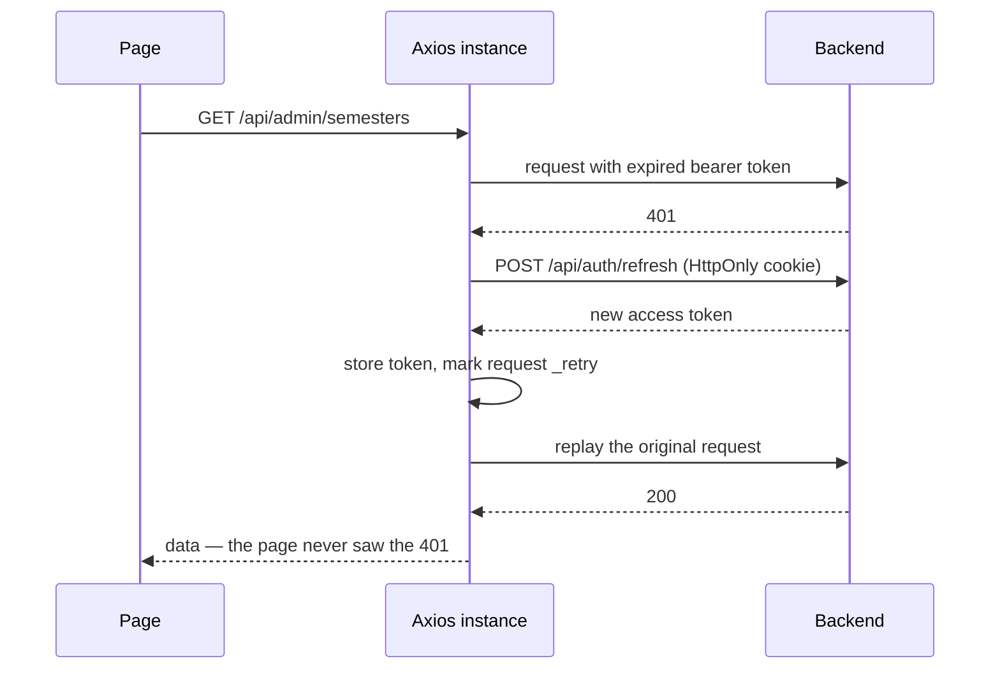

<div align="center">

# Smart Review — Web Client

**React 19 single-page application for the capstone review platform: Excel imports,
semester planning, slot registration, and the review timetable.**

[](https://react.dev/)
[](https://www.typescriptlang.org/)
[](https://vite.dev/)
[](https://reactrouter.com/)
[](https://axios-http.com/)
[](https://vercel.com/)

[Features](#what-it-does) · [Architecture](#architecture) ·
[API client](#the-api-client) · [Design system](#design-system) ·
[Getting started](#getting-started) ·
[Backend repo](https://github.com/Le-Giang-3003/FPTCapstones)

</div>

---

## Overview

This is the browser client for **Smart Review**, a system that runs capstone review sessions
for a university department: importing the semester's lecturers, students and project groups,
planning the review windows, collecting slot preferences from groups and availability from
reviewers, then publishing the timetable that the scheduling engine produces.

The API it talks to lives in
[`FPTCapstones`](https://github.com/Le-Giang-3003/FPTCapstones) — ASP.NET Core 8, Clean
Architecture, CQRS.

Everything here is built without a component library or a CSS framework. Layout, tables,
modals, tooltips and the theme system are hand-written on top of CSS custom properties.

### At a glance

| | |
|---|---|
| **Stack** | React 19 · TypeScript 6 · Vite 8 |
| **Routing** | React Router 7, with a role-aware `PrivateRoute` guard |
| **State** | React context — `AuthContext` and `ThemeContext`. No Redux, no data-fetching library. |
| **HTTP** | A single Axios instance with request and response interceptors |
| **Auth** | Google Identity Services sign-in, JWT in `localStorage`, silent refresh on 401 |
| **Styling** | Vanilla CSS, custom design tokens, animated light and dark themes |
| **Size** | 13 screens · 30 source files · ~8.8k lines |

---

## What it does

Access is driven by role, and one account can hold several roles at once.

| Role | What they can do |
|---|---|
| **Admin** | Import users, lecturers and groups from Excel; manage semesters, holiday templates and semester holidays; create review windows and slots; nominate reviewers; run the scheduler; read audit logs |
| **Lecturer** | Browse the projects they supervise and the semester timeline |
| **Reviewer** | Register availability for review slots and see the sessions assigned to them |
| **Student leader** | Register up to five preferred slots for their group, submit document versions |
| **Group member** | View their group, its documents and its review schedule |

### Screens

| Route | Screen | Who |
|---|---|---|
| `/login` | Google sign-in | Anyone |
| `/dashboard` | Role-scoped overview and key counts | All signed-in roles |
| `/topics` | Project and group management | Admin, Lecturer |
| `/admin/users` | User accounts, roles, activation | Admin |
| `/admin/lecturers` | Lecturer list and Excel import | Admin |
| `/admin/import` | Excel import for groups and students, with progress polling | Admin |
| `/admin/semesters` | Semester planning, timeline, holidays, review windows | Admin |
| `/admin/holiday-templates` | Recurring annual holidays | Admin |
| `/admin/reviewers` | Nominate lecturers as reviewers for a review window | Admin |
| `/admin/scheduling` | Run the scheduler, poll the job, read the resulting timetable | Admin |
| `/reviews/slots` | Slot registration: preferences for groups, availability for reviewers | Reviewer, students |
| `/projects/:id` | Group detail, members, document versions, upload and finalize | Authenticated |
| `/audit-logs` | Action history | Admin |

---

## Architecture

```text
src/
├── main.tsx                  GoogleOAuthProvider > ThemeProvider > AuthProvider > App
├── App.tsx                   route table + PrivateRoute guard + role-based home redirect
│
├── contexts/
│   ├── AuthContext.tsx       session state, Google login, /api/auth/me hydration, logout
│   └── ThemeContext.tsx      light/dark toggle, persisted, applied before first paint
│
├── services/
│   └── api.ts                the single Axios instance — every request goes through it
│
├── components/
│   ├── Layout.tsx            collapsible sidebar, role-filtered navigation, topbar
│   └── Tooltip.tsx           positioned tooltip used by the collapsed sidebar
│
├── pages/                    one file per screen
│
├── types/
│   └── index.ts              every DTO the API returns, typed
│
├── utils/
│   ├── role.ts               parses the backend's [Flags] role string
│   └── reviewSlotTime.ts     maps a slot index to its wall-clock time range
│
├── index.css                 design tokens, base elements, shared component classes
└── App.css                   layout and page-level styles
```

Three rules keep this consistent as it grows.

- **Every HTTP call goes through `services/api.ts`.** No bare `fetch`, no bare `axios`
  anywhere else. That is what makes the token handling below a single place rather than
  fourteen.
- **Every API shape is declared in `types/index.ts`**, named after the backend DTO it
  mirrors, so a contract change surfaces as a compile error rather than as `undefined` at
  runtime.
- **Colors and radii come from CSS custom properties**, never from literals in a component.

### Route protection

`PrivateRoute` handles three states rather than two: still loading the session, signed out,
and signed in without the required role.

```tsx
<Route
  path="/admin/scheduling"
  element={
    <PrivateRoute roles={['Admin']}>
      <AdminScheduling />
    </PrivateRoute>
  }
/>
```

Waiting for `loading` to settle before deciding matters here. Without it, a page refresh
would bounce a signed-in administrator to `/login` for the moment before the session is
rehydrated from storage.

---

## The api client

`src/services/api.ts` is small and does three jobs. It is the piece of this codebase most
worth reading.

**1. It attaches the access token.** A request interceptor reads the token from
`localStorage` and sets the `Authorization` header, so no call site ever thinks about auth.

**2. It refreshes expired sessions silently.** Access tokens live 15 minutes. When a response
comes back `401`, the interceptor calls the refresh endpoint, stores the new access token,
and **replays the original request** — so the user never sees the failure.



The refresh token itself never touches JavaScript. It rides in an `HttpOnly; Secure;
SameSite=None` cookie set by the API, which is why the instance is created with
`withCredentials: true`.

Two guards keep this from misbehaving:

- `originalRequest._retry` marks a request that has already been replayed, so a still-failing
  call cannot start an infinite refresh loop.
- The auth endpoints themselves are exempt. A `401` from `/api/auth/google` or
  `/api/auth/refresh` is a genuine sign-in failure and must reach the UI intact instead of
  triggering another refresh.

**3. It fails cleanly.** If the refresh also fails, the client clears the stored session and
sends the user to `/login` — unless they are already there, which avoids a redirect loop on
the login page.

### Roles arrive as a flag string

The backend stores roles as a `[Flags]` enum, so `role` comes back as `"Admin"` for one role
or `"Admin, Lecturer"` for several. `utils/role.ts` parses that into a `Set` once and exposes
`hasRole`, `hasAnyRole` and `hasAllRoles`, which the router and the sidebar both use. Nothing
in the app compares the role string with `===`.

---

## Design system

The theme is defined as CSS custom properties on `:root`, with a `:root.dark` variant. Every
component reads tokens; none of them hardcode a color.

| Token group | Values |
|---|---|
| Accent | FPT Orange `#f37021` for calls to action and active state, Sunshine Yellow `#f0b100` as the secondary accent |
| Surfaces | Cloud White `#ffffff` background, `#f4f4f5` for secondary sections, `#e4e4e7` borders |
| Text | `#09090b` primary, `#71717b` secondary, `#9f9fa9` for placeholders |
| Radii | 16px on cards, 12px on buttons, 8px on form controls |
| Elevation | One soft shadow, used sparingly |
| Type | Montserrat for headings, Roboto for body — both chosen to render Vietnamese diacritics crisply on Windows |

Two details are worth pointing out.

**Themes animate rather than snap.** The color tokens are registered with `@property` and
typed as `<color>`, which lets the browser interpolate them. Toggling the theme cross-fades
the whole interface in 250ms instead of flipping it in one frame — something plain custom
properties cannot do, because untyped properties are not animatable.

```css
@property --bg-primary { syntax: '<color>'; inherits: true; initial-value: #ffffff; }
```

**The theme is applied before the first paint.** `ThemeContext` reads the stored preference
inside the `useState` initialiser and writes the class onto `document.documentElement` right
there, rather than waiting for an effect. That removes the flash of the wrong theme on reload
and after logout.

---

## Getting started

### Prerequisites

Node.js 20 or newer, and a running instance of the
[backend API](https://github.com/Le-Giang-3003/FPTCapstones).

### Install and run

```bash
git clone https://github.com/Le-Giang-3003/FPTCapstones-FE.git
cd FPTCapstones-FE
npm install
npm run dev
```

The dev server starts on `http://localhost:5173`. Add that origin to the backend's
`Cors:Origins` list, or sign-in requests will be blocked by the browser.

### Environment variables

Vite exposes only variables prefixed with `VITE_`, and inlines them at build time. Nothing
here is a secret — the Google client ID is public by design — but treat these files as build
configuration, not as a place for keys.

| Variable | Purpose | Development value |
|---|---|---|
| `VITE_API_URL` | Backend origin used in development | `https://localhost:7198` |
| `VITE_GOOGLE_CLIENT_ID` | Google OAuth 2.0 web client ID | from the Google Cloud console |

In production `VITE_API_URL` is deliberately ignored. The client forces a same-origin base
URL so that requests go to `/api/...` on the Vercel domain and are proxied from there. This
is what keeps the browser from seeing a cross-origin call, and it prevents a misconfigured
environment variable from pointing the app at a plain-HTTP backend and triggering
mixed-content errors.

### Scripts

| Command | What it does |
|---|---|
| `npm run dev` | Vite dev server with hot module replacement |
| `npm run build` | Type-checks with `tsc -b`, then produces a production bundle in `dist/` |
| `npm run preview` | Serves the built bundle locally |
| `npm run lint` | ESLint 10 flat config, with the React Hooks and React Refresh plugins |

The build type-checks before it bundles, so a type error fails the build rather than shipping.

---

## Deployment

Deployed to Vercel as a single-page application. `vercel.json` does two things:

```json
{
  "rewrites": [
    { "source": "/api/:path*", "destination": "https://api.f-caps.net/api/:path*" },
    { "source": "/(.*)", "destination": "/index.html" }
  ]
}
```

- **The API proxy** forwards `/api/*` to the backend. Because the browser only ever talks to
  the Vercel origin, there is no CORS preflight on normal traffic and the refresh cookie is
  first-party rather than third-party — which matters, since browsers increasingly block
  third-party cookies outright.
- **The SPA fallback** serves `index.html` for any unmatched path, so deep links like
  `/admin/scheduling` survive a hard refresh instead of returning 404.

---

## Roadmap

- [ ] **Tests.** There is no test runner configured yet. Vitest plus React Testing Library,
      starting with `utils/role.ts` and the Axios refresh interceptor, would cover the two
      places where a silent bug is most costly.
- [ ] **A data-fetching layer.** Pages currently call the API from `useEffect` and manage
      loading and error state by hand. TanStack Query would remove that boilerplate and add
      caching and request deduplication.
- [ ] **Split the largest screens.** The semester planner and the slot registration page have
      grown past a comfortable single-file size and should be decomposed into components.
- [ ] **Push instead of polling** for import and scheduling progress, once the API exposes it.
- [ ] **Accessibility pass** — focus management in modals, keyboard navigation for the
      timetable grid, and a contrast audit of both themes.

---

## Related

| | |
|---|---|
| Backend | [FPTCapstones](https://github.com/Le-Giang-3003/FPTCapstones), ASP.NET Core 8 with Clean Architecture and CQRS |
| Author | [Le-Giang-3003](https://github.com/Le-Giang-3003) |

Built as a capstone project at FPT University and published for portfolio purposes.
